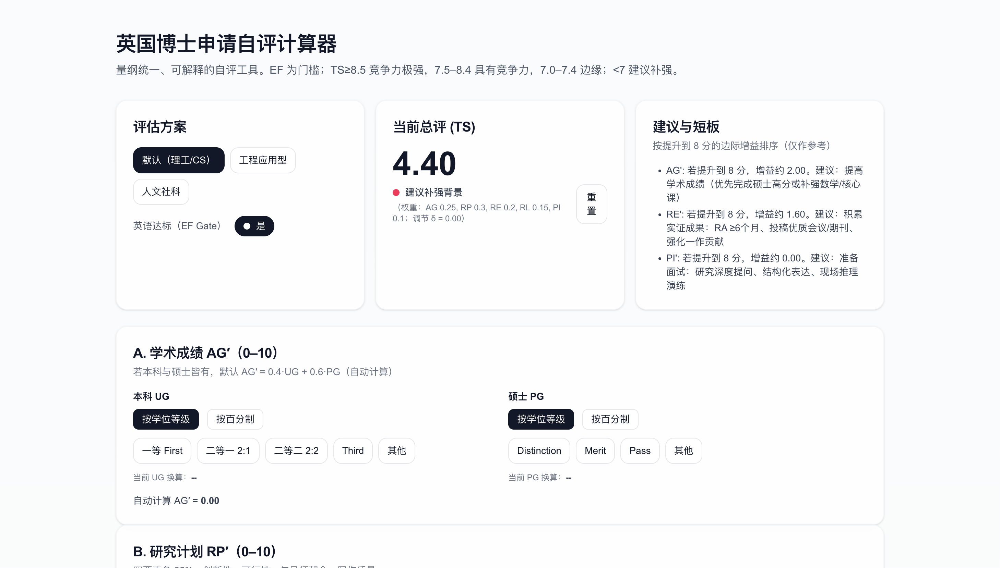

# 🎓 PhD Application Readiness Calculator / 博士申请竞争力自评计算器

[](https://nextjs.org/) 
[](https://www.typescriptlang.org/) 
[](https://tailwindcss.com/) 
[](https://vercel.com/)

---

## 📖 Overview / 项目简介

🌐 **Live Demo:** [Doctoral Application Readiness Calc](https://doctoral-application-readiness-calc.vercel.app/)

PhD Application Readiness Calculator is an intuitive web application that empowers doctoral applicants to assess their competitiveness quickly and accurately. Utilizing a standardized 0–10 scoring rubric across critical dimensions, it delivers actionable insights to improve your application.


博士申请竞争力自评计算器是一款简洁易用的网页工具，帮助博士申请者快速、精准地评估自身竞争力。基于统一的0–10量表，覆盖关键维度，提供切实可行的提升建议。

  

---

## ✨ Features / 功能亮点

- **Unified 0–10 Rubric / 统一量表**  
  Standardized scoring across academic records, research proposals, experience, recommendations, and interviews.

- **Dynamic Scoring / 动态打分**  
  Real-time total score updates and identification of weakest areas.

- **Targeted Hints / 定向建议**  
  Intelligent suggestions focusing on the most impactful improvements.

- **Multiple Schemes / 多种评估方案**  
  Customizable weighting for STEM, engineering applications, and humanities/social sciences.

- **Responsive UI / 自适应界面**  
  Optimized for both desktop and mobile devices.

- **Language Gate / 语言门槛**  
  Simulates realistic language proficiency requirements in the application process.

---

## 🛠 Tech Stack / 技术栈

- **Framework / 框架:** [Next.js 15](https://nextjs.org/) + App Router  
- **Language / 语言:** TypeScript  
- **Styling / 样式:** Tailwind CSS  
- **Deployment / 部署:** [Vercel](https://vercel.com/)  

---

## 🚀 Getting Started / 快速开始

### 1️⃣ Install Dependencies / 安装依赖

```bash
npm install
```

### 2️⃣ Run Development Server / 启动开发服务器

```bash
npm run dev
```

### 3️⃣ Open in Browser / 浏览器访问

Navigate to [http://localhost:3000](http://localhost:3000)

---

## ☁️ Deployment / 部署

This project is optimized for deployment on [Vercel](https://vercel.com/). Simply connect your repository and deploy with zero configuration.

---

## 📊 Scoring Dimensions / 评分维度

| Dimension          | Description / 描述                             |
|--------------------|-----------------------------------------------|
| Academic Records    | GPA, coursework rigor, academic honors / GPA、课程难度、学术荣誉 |
| Research Proposal   | Clarity, originality, feasibility / 计划清晰度、创新性、可行性 |
| Research Experience | Publications, projects, internships / 发表论文、项目经验、实习经历 |
| Recommendation Letters | Strength, relevance, credibility / 推荐信强度、相关性、可信度 |
| Interview Performance | Communication, subject knowledge / 沟通能力、专业知识 |

---


## 📄 License / 许可证

MIT License © 2025

---

## ⚠️ Disclaimer / 免责声明

 This tool provides an approximate evaluation based on user input and should not replace official application advice or decisions. Use it as a guide to better understand your strengths and areas for improvement.

 本工具基于用户输入提供大致评估，不应替代官方申请建议或决定。仅供参考，帮助您更好地了解自身优势与不足。
